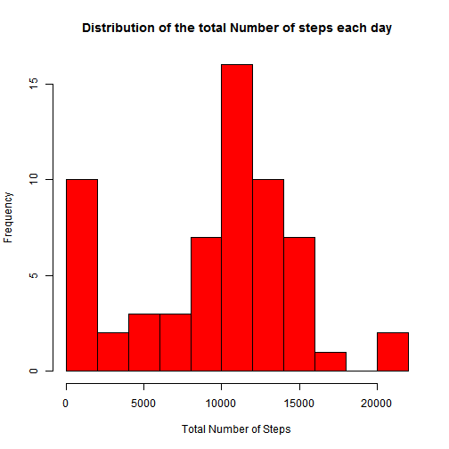
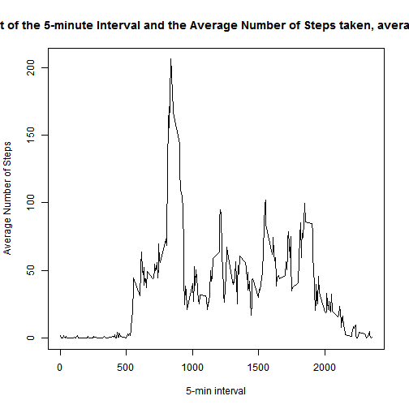
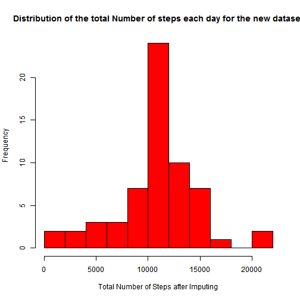
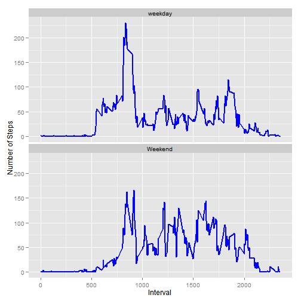

Reproducible Research: Peer Assessment 1
==========================================


## Loading and preprocessing the data

```r
# Set working directory
# setwd("GitHub/RepData_PeerAssessment1")

# Download activity dataset or you can get it when you Fork/Clone the RedData_PeerAssessment1
# fileUrl <- "https://d396qusza40orc.cloudfront.net/repdata%2Fdata%2Factivity.zip"
# download.file(fileUrl, destfile = "activity.zip")

# Unzip and read the activity dataset
unzip("activity.zip")
activity <- read.csv("activity.csv")
```


## What is mean total number of steps taken per day?

```r
# Now calculate activiy per Day of the person
# activityPerDay <- aggregate(steps ~ date, activity, sum, na.rm = TRUE)
# it is interesting that by using aggregate() function for calculating activityPerDay Mean is 10766 and median is 10765 as from both (activityPerDay calculated by aggregate() and tapply()) steps per day is coming same I don't know why this is happenning
activityPerDay <- tapply(activity$steps, activity$date, sum, na.rm = TRUE)

# Plot the histogram of the total number of steps taken each day
hist(activityPerDay, breaks = 10, col = "red", main = "Distribution of the total Number of steps each day", xlab = "Total Number of Steps")
```

 

```r
# Mean of steps per day
mean(activityPerDay)
```

```
## [1] 9354
```

```r
# Median of steps per day
median(activityPerDay)
```

```
## [1] 10395
```


## What is the average daily activity pattern?

```r
# The average number of steps grouped by intereval
activityPerDayAvg = tapply(activity$steps, activity$interval, mean, na.rm = T)

# Plot the time series graph of the 5-minute interval (x-axis) and the average number of steps taken, averaged across all days (y-axis)
plot(activityPerDayAvg ~ unique(activity$interval), type="l", main = "Time Series Plot of the 5-minute Interval and the Average Number of Steps taken, averaged across all days", xlab = "5-min interval", ylab= "Average Number of Steps")
```

 

```r
# activityPerDayAvg <- aggregate(steps ~ interval, activity, mean, na.rm = TRUE)
# ggplot(activityPerDayAvg, aes(x=interval,y=steps)) + geom_line(color="blue",size=1) + ggtitle("Time Series Plot of the 5-minute Interval and the Average Number of Steps taken, averaged across all days") + labs(x="Interval",y="Average Number of Steps")

# Now to find the maximium number of steps in 5-minute interval on average across all the days
activityPerDayAvg[which.max(activityPerDayAvg)]
```

```
##   835 
## 206.2
```


## Imputing missing values

```r
# The total number of missing values in the dataset 
# table(is.na(activity) == TRUE)
sum(is.na(activity))
```

```
## [1] 2304
```

```r
# Creating a new dataset activityImputing by filling in all of the missing values in the activity dataset.
# Strategy for the new dataset is by replacing the NA with the mean of the steps taken on the particular interval
activityImputing <- activity
for (i in 1 : nrow(activity))
        {
        if(is.na(activity$steps[i]))
                {
                activityImputing$steps[i] <- activityPerDayAvg[[as.character(activity[i, "interval"])]]
                }
        }

# Now calculate activiy per Day of the person from the new datset
activityPerDayImputing <- tapply(activityImputing$steps, activityImputing$date, sum, na.rm = TRUE)

# Plot the histogram of the total number of steps taken each day for this new datset
hist(activityPerDayImputing, breaks = 10, col = "red", main = "Distribution of the total Number of steps each day for the new dataset", xlab = "Total Number of Steps after Imputing")
```

 

```r
# Mean of steps per day
mean(activityPerDayImputing)
```

```
## [1] 10766
```

```r
# Median of steps per day
median(activityPerDayImputing)
```

```
## [1] 10766
```

```r
# Comparing the mean and median of the old activity and new activityImputing dataset
# Original dataset with NA
summary(activityPerDay)
```

```
##    Min. 1st Qu.  Median    Mean 3rd Qu.    Max. 
##       0    6780   10400    9350   12800   21200
```

```r
# New dataset with Imputing NA
summary(activityPerDayImputing)
```

```
##    Min. 1st Qu.  Median    Mean 3rd Qu.    Max. 
##      41    9820   10800   10800   12800   21200
```

```r
# You can clearely see that the mean and the median for the new dataset increases, because for replacing NA we add some value to its variable
```


## Are there differences in activity patterns between weekdays and weekends?

```r
# Create a new factor variable in the dataset with two levels - "weekday" and "weekend" indicating whether a given date is a weekday or weekend day.
activityDayType <- activityImputing
activityDayType$date <- as.Date(activityDayType$date, "%Y-%m-%d")

for (i in 1 : nrow(activity))
        {
        if (weekdays(activityDayType[i,2]) %in% c("Saturday", "Sunday"))
                {
                activityDayType[i, "daytype"] <- "Weekend"
                }
        else
                {
                        activityDayType[i, "daytype"] <- "weekday"
                }
        }

#activityDayType_PerDayAvg = tapply(activityDayType$steps, activityDayType$daytype, mean, na.rm = T)
activityDayTypeAgg <- aggregate(steps ~ interval + daytype, activityDayType, mean)
# Plot the 5-minute interval (x-axis) and the average number of steps taken, averaged across all weekday days or weekend days (y-axis)
library(ggplot2)
ggplot(activityDayTypeAgg, aes(x = interval, y = steps)) + 
geom_line(color = "blue", size = 1) + 
facet_wrap(~ daytype, nrow =2, ncol = 1) + 
labs(x = "Interval", y = "Number of Steps")
```

 


```r
# To make HTML and markdown file from the Rmarkdown file
#library(knitr)
#knit("PA1_template.Rmd")
#knit2html("PA1_template.Rmd")
```
